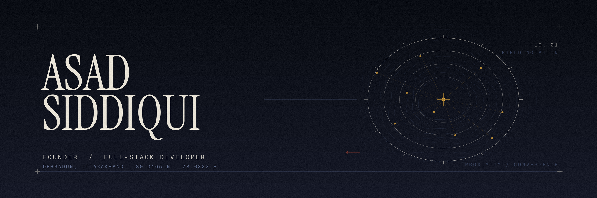

  

  
  
  
  
  

---

I'm building **[Lettzo](https://www.lettzo.com)**, an app for finding what's happening near you and actually making plans with people instead of just talking about it. I do all of it myself: design, frontend, backend, deploys.

 

Code isn't the only thing I do. I edit video, shoot photos, design, and I'm good at working out why something spreads. I ran football pages that did 50M+ views by paying attention to which formats kept winning and reusing them instead of starting from scratch every time.

Before this I played football at state level, competed in PUBG Mobile esports and co-founded a team, and spent a few years helping run my family's hotel in Uttarakhand.

Football, games, startups. In that order most days.

 

### Languages

  
  
  
  
  
  

### Frontend

  
  
  
  
  
  

### Backend &amp; Data

  
  
  
  
  
  
  
  
  
  

### AI &amp; Tools

  
  
  
  
  
  

 

### Things I've done

- **50M+ organic views** across football content pages, one grown to 38K followers in a few months
- Top **900 of 82,000+** in the Amazon ML Challenge 2025
- Research paper on AI glaucoma detection from retinal scans, currently under peer review
- PUBG Mobile: **Asia Season 19 top 500**, India top 50. Co-founded COR3 Esports and ran grassroots tournaments
- State-level footballer
- Picked as a teaching assistant from 3,000+ students
- Helped double the revenue at my family's hotel

 

  
  

